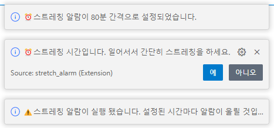
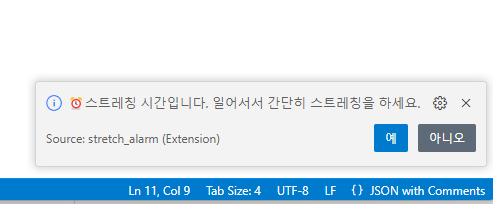
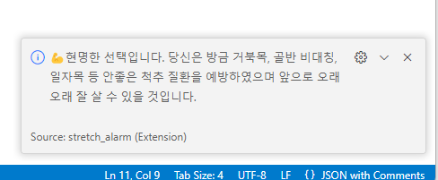
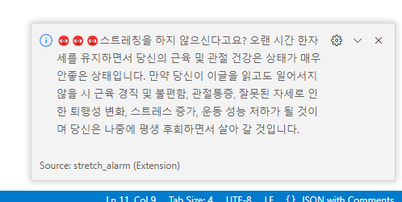
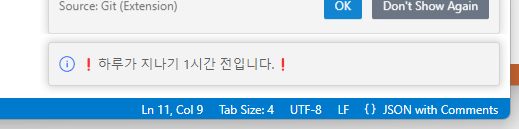
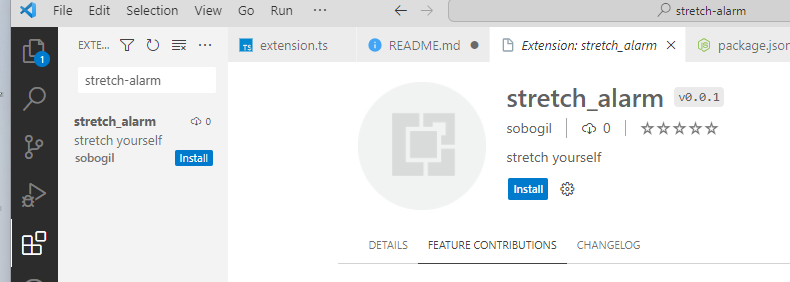
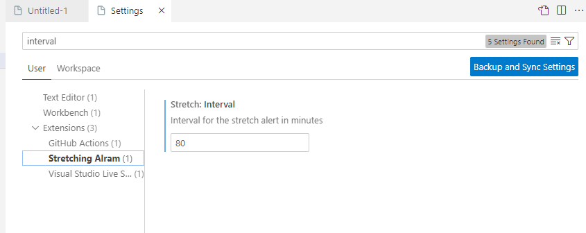
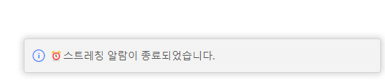

# ⏰ stretch-alarm


## 목차

- [Motivation](#introduction)
- [Description](#installation)
- [Usage](#usage)

## Motivation <a name="introduction"></a>

* 많은 사람들이 vscode를 사용을 하는데 하다보면 장시간 스트레칭도 안하고 작업을 진행해 스트레칭을 권장할 겸 만들게 되었다.

## Description <a name="installation"></a>

* vscode의 확장 프로그램으로 한시간마다 알림을 준다.

1. 시작시 알림을 주어 프로그램이 실행 됐다는 것을 알려준다.  


2. 한시간이 지나면 해당 알림이 온다.  


3. 예를 눌렀을 시 (체조 동영상 url로 이동할 수 있다)   
 

4. 아니오를 눌렀을 시  


5. 밤 11시에 나오는 알림  

## Usage <a name="usage"></a>

1. 다운받는 방법
    * vscode extensions에 stretch-alarm이라고 검색하고 install한 후 command palette에서 `stretching`을 입력하면 사용해볼 수 있다.    
      
    * [Marketplace](https://marketplace.visualstudio.com/items?itemName=sobogil.stretch-alarm&ssr=false#overview)

2. 시간 지정하고 만들어 보기
    ```
    git clone https://github.com/sobogil/stretch-alarm.git
    ```
    src/extension.ts파일에서 시간 값을 변경하여 본인에게 원하는 알람으로 만들면 된다.   

* 알람시간 지정 방법
  
`manage`(좌측 하단 톱니바퀴모양) -> `setting`-> 검색창에 `interval` 이라고 치면 알람 시간을 본인이 지정 할 수 있다.  
(프로그램 시작전에 설정해 주세요)

* 프로그램이 실행된 상태에서 다시 시작시 종료가 된다

**Enjoy!**
