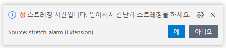
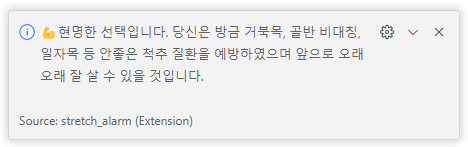
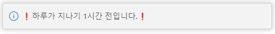

# ⏰ stretch-alarm

## 목차

- [계기](#introduction)
- [Description](#installation)
- [Usage](#usage)

## 계기 

* 많은 사람들이 vscode를 사용을 하는데 하다보면 장시간 스트레칭도 안하고 작업을 진행해 스트레칭을 권장할 겸 만들게 되었다.

## Description 

* vscode의 확장 프로그램으로 한시간마다 알림을 준다.

1. 시작시 알림을 주어 프로그램이 실행 됐다는 것을 알려준다.  

2. 한시간이 지나면 해당 알림이 온다.  

3. 예를 눌렀을 시  
 

4. 아니오를 눌렀을 시  

5. 밤 11시에 알려주는 현재 시각  

## Usage 

프로젝트를 사용하는 방법에 대한 내용을 작성합니다.
**Enjoy!**
