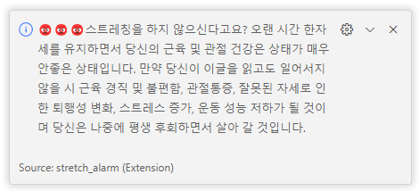

# ⏰ stretch-alarm

## 목차

- [Motive](#introduction)
- [Description](#installation)
- [Usage](#usage)

## Motive 

* 많은 사람들이 vscode를 사용을 하는데 하다보면 장시간 스트레칭도 안하고 작업을 진행해 스트레칭을 권장할 겸 만들게 되었다.

## Description 

* vscode의 확장 프로그램으로 한시간마다 알림을 준다.

1. 시작시 알림을 주어 프로그램이 실행 됐다는 것을 알려준다.  

2. 한시간이 지나면 해당 알림이 온다.  

3. 예를 눌렀을 시  
 

4. 아니오를 눌렀을 시  

5. 밤 11시에 나오는 알림  

## Usage 

1. 다운받는 방법
    * vscode extensions에 stretch-alarm이라고 검색하고 install한 후 command palette에서 'stretching'을 입력하면 사용해볼 수 있다. 
    
[Marketplace](https://marketplace.visualstudio.com/items?itemName=sobogil.stretch-alarm&ssr=false#review-details)

2. 시간 지정하고 만들어 보기
    '''
    git clone https://github.com/sobogil/stretch-alarm.git
    '''
    후 src/extension.ts파일에서 시간 값을 변경하여 본인에게 원하는 알람으로 만들면 된다.   

**Enjoy!**
